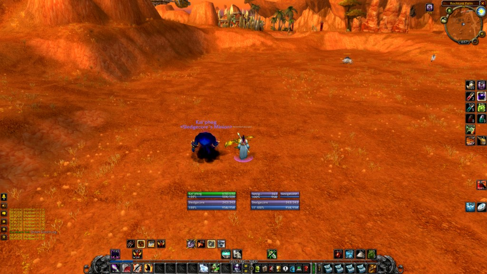

# Phase 1 Review

## Success Criteria
- [x] Player frame works correctly
- [x] Target frame works correctly
- [x] No Lua errors
- [ ] Performance < 1% CPU
- [x] Size < 500KB (build/release ~292KB)

**Proof (in-game):** Screenshot showing player and pet unit frames in WoW (Hellfire Peninsula), with health/power bars and tags rendering correctly:

## Context: Current Project vs Phase 1 Plan

### What Matches Phase 1
- **Strip:** `options/` and `media/` are gone. Only `localization/enUS.lua` remains. The long list of modules in `phase1/build/strip.md` was removed; the repo has a small set of modules and a **build system** (`build/build.sh` → `build/release/`) that assembles the addon from source + libs.
- **Core files:** ShadowedUnitFrames.lua, units, layout, health, power, defaultlayout, movers, helpers, basecombopoints are present. **tags.lua** was re-added (Phase 1 CHANGES said it was removed) so that layout text tags like `[name]`, `[afk]`, `[curmaxhp]` work.
- **No options UI:** Configuration is driven by code, not saved-variable layout. Layout is fixed in `modules/defaultlayout.lua` for all users (see RULES.md §8).

### What Diverges from Phase 1
- **Config.lua vs defaultlayout.lua:** Phase 1 planned a single “hardcoded config” in `Config.lua` (player bottom center, target right). In practice the addon **does not use `Config.lua`** (nothing reads `_G.SUFconfig`). All layout and positions come from **`modules/defaultlayout.lua`** via `LoadDefaultLayout()` (run on every init). So:
  - **Source of truth for positions:** `config.positions` in `defaultlayout.lua` (e.g. `config.positions.player`, `config.positions.target`). See RULES.md §8.
  - **Config.lua** is legacy/unused; it could be removed or repurposed later.
- **Player position:** In `defaultlayout.lua`, player is `point = "CENTER", anchorTo = "UIParent", relativePoint = "CENTER", y = -190, x = -89` (not “bottom center y+200” from the Phase 1 tasks). Target is `anchorTo = "#SUFUnitplayer", x = 50` (right of player). To change positions, edit `config.positions` in `defaultlayout.lua`.
- **units.lua:** Phase 1 wanted “player + target only”. The codebase still has the full unit list (party, raid, arena, boss, etc.); visibility is controlled by **defaultlayout** and **hidden** (e.g. party/raid hidden by default). So “MVP” is achieved by layout/visibility, not by stripping units.lua to only two unit types. AFK support added `PLAYER_FLAGS_CHANGED` and `UNIT_FLAGS` for player/party/raid.
- **Size:** Phase 1 target was &lt; 500KB. Current build/release is ~292KB for the addon files; with libs the total is larger (see build output). The &lt; 500KB criterion may need to apply to “addon folder total” or be relaxed if libs are required.

### Outdated Phase 1 Docs
- **phase1/plan/tasks.md:** “Create Config.lua with hardcoded positions” and “Define player frame position (BOTTOM center)” are superseded by **defaultlayout.lua** as the single layout source. Task 1.4 should be “Layout and positions live in defaultlayout.lua (config.positions).”
- **phase1/build/strip.md:** Says “Remove … modules/tags.lua”. The project **keeps** tags.lua; remove that line from the strip list.
- **phase1/CHANGES.md:** Lists tags.lua as removed; it was re-added. “Config.lua - Hardcoded configuration” is correct for the file’s intent but the addon does not use it at runtime.

## Issues Found
- **Config.lua unused:** No references to `SUFconfig` in ShadowedUnitFrames.lua or modules. Either remove Config.lua or document it as “optional override” and implement reading it; otherwise it’s dead code.
- **Success criteria:** “Size < 500KB” is ambiguous (addon only vs with libs). Recommend “build/release addon folder” and measure after `./build/build.sh` and optional `./build/copy-to-wow.sh`.
- **Checklist positions:** `phase1/test/checklist.md` says “Frame is positioned correctly (bottom center)” and “(right of player)”. Actual positions are in defaultlayout.lua (player: center offset, target: right of player); checklist should say “per defaultlayout.lua” or update to match current values.

## Fixes Needed
1. **Optional:** Remove `Config.lua` from TOC and repo, or add a short comment in Config.lua that layout is driven by defaultlayout.lua and this file is reserved for future use.
2. Update **phase1/plan/tasks.md** so 1.4 reflects defaultlayout.lua as the layout source and remove or adjust the “Create Config.lua” wording.
3. Update **phase1/build/strip.md** so the “Remove” list does not include `modules/tags.lua`.
4. Update **phase1/CHANGES.md** with a “Review 2026-02-24” entry noting: layout source is defaultlayout.lua; tags.lua kept; Config.lua unused; positions in defaultlayout.lua.

## Decision
- [x] **APPROVE** - Ready for Phase 2
- [ ] **NEEDS FIXES** - Update phase1 docs and optionally Config.lua
- [ ] **REVIEW** - Discuss with team

## Notes
- Player and pet (and target) frames are implemented and driven by `defaultlayout.lua`. In-game screenshot confirms no Lua errors, frames visible with health/power bars and tags. Phase 1 complete; Phase 2 (e.g. cast bar, auras) can start.
